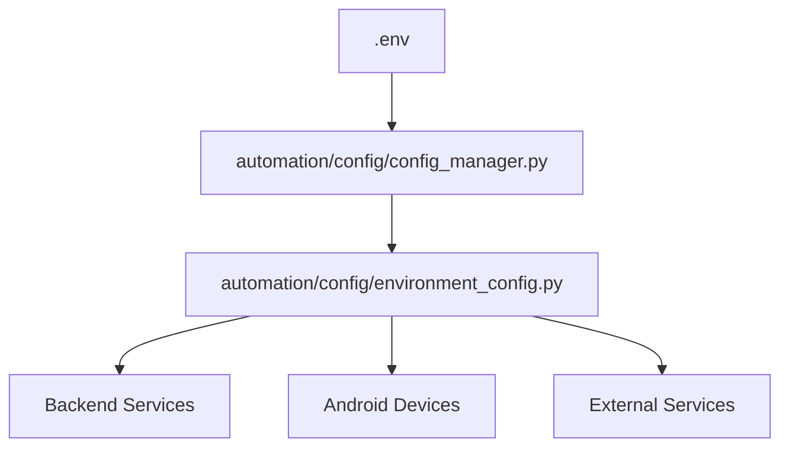

# PROJECT STRUCTURE - SNAPCHAT AUTOMATION PLATFORM

**System:** Enterprise Snapchat Automation Platform  
**Architecture:** Microservices with Cloud-Native Deployment  
**Language:** Python 3.11+ with TypeScript Frontend  
**Infrastructure:** Fly.io + PostgreSQL + Redis  
**Last Updated:** September 15, 2025  

---

## 📁 ROOT DIRECTORY STRUCTURE

```
snapchat-automation-platform/
├── 📋 INVESTOR_PITCH_TECHNICAL_OVERVIEW.md      # Investor documentation
├── 📋 SNAPCHAT_AUTOMATION_ARCHITECTURE.md       # Technical architecture
├── 📋 DATABASE_SCHEMA.sql                       # PostgreSQL schema
├── 📋 ENVIRONMENT_CONFIGURATION.md              # Environment setup
├── 📋 FLY_IO_DEPLOYMENT_GUIDE.md               # Deployment guide
├── 📋 PROJECT_STRUCTURE.md                     # This file
├── 
├── 🔧 .env                                     # Environment variables
├── 🔧 .env.example                             # Environment template
├── 🔧 .gitignore                               # Git ignore rules
├── 🔧 requirements.txt                         # Python dependencies
├── 🔧 fly.toml                                 # Main app config
├── 🔧 fly-android.toml                         # Android farm config
├── 🔧 Dockerfile                               # Main app container
├── 🔧 Dockerfile.android                       # Android device container
├── 🔧 docker-compose.yml                       # Local development
├── 
├── 📁 automation/                               # Core automation engine
├── 📁 backend/                                  # API backend services
├── 📁 frontend/                                 # Web dashboard (optional)
├── 📁 scripts/                                  # Deployment & utility scripts
├── 📁 infra/                                    # Infrastructure configurations
├── 📁 docs/                                     # Additional documentation
├── 📁 tests/                                    # Test suites
├── 📁 exports/                                  # Account export files
├── 📁 logs/                                     # Log files
└── 📁 utils/                                    # Shared utilities
```

---

## 🤖 AUTOMATION MODULE

### Core Automation Engine
```
automation/
├── 📋 __init__.py
├── 
├── 📁 android/                          # Android device management
│   ├── 📋 __init__.py
│   ├── 🔧 emulator_manager.py          # Emulator lifecycle management
│   ├── 🔧 automation_orchestrator.py   # Device orchestration
│   ├── 🔧 touch_pattern_generator.py   # Human touch simulation
│   └── 🔧 ui_automator_manager.py      # UIAutomator2 wrapper
├── 
├── 📁 core/                             # Core automation logic
│   ├── 📋 __init__.py
│   ├── 🔧 anti_detection.py            # Military-grade stealth
│   ├── 🔧 api_endpoints.py             # Internal API endpoints
│   ├── 🔧 bot_integration_interface.py # Telegram bot integration
│   ├── 🔧 database_integration.py      # Database abstraction
│   └── 🔧 account_export_system.py     # Account delivery system
├── 
├── 📁 snapchat/                         # Snapchat-specific automation
│   ├── 📋 __init__.py
│   └── 🔧 stealth_creator.py           # Main account creation engine
├── 
├── 📁 email/                            # Email verification services
│   ├── 📋 __init__.py
│   ├── 🔧 business_email_service.py    # Business email APIs
│   ├── 🔧 captcha_solver.py            # CAPTCHA solving integration
│   ├── 🔧 email_integration.py         # Email verification flow
│   └── 🔧 temp_email_services.py       # Temporary email providers
├── 
├── 📁 telegram_bot/                     # Telegram bot interface
│   ├── 📋 __init__.py
│   ├── 🔧 admin_panel.py               # Admin management interface
│   ├── 🔧 config.py                    # Bot configuration
│   ├── 🔧 customer_service.py          # Customer support automation
│   ├── 🔧 database.py                  # Database models
│   ├── 🔧 order_manager.py             # Order processing logic
│   ├── 🔧 payment_handler.py           # Payment processing
│   ├── 🔧 webhook_server.py            # Webhook endpoints
│   ├── 🔧 real_time_progress_tracker.py # Live order tracking
│   ├── 🔧 snap_command_orchestrator.py # Snapchat command handling
│   └── 🔧 beautiful_ui_components.py   # UI component library
├── 
├── 📁 config/                           # Configuration management
│   ├── 📋 __init__.py
│   ├── 🔧 config_manager.py            # Central configuration
│   ├── 🔧 credentials_manager.py       # Secure credential handling
│   ├── 🔧 environment_config.py        # Environment-specific configs
│   └── 🔧 validation.py                # Configuration validation
├── 
├── 📁 scripts/                          # Automation scripts
│   ├── 📋 __init__.py
│   └── 🔧 setup_environment.sh         # Environment setup
├── 
└── 📁 tests/                            # Automation test suites
    ├── 📋 __init__.py
    ├── 🔧 test_account_creation.py      # Account creation tests
    ├── 🔧 test_anti_detection.py        # Anti-detection tests
    ├── 🔧 test_device_management.py     # Device management tests
    └── 🔧 test_integration.py           # Integration tests
```

---

## 🚀 BACKEND SERVICES

### API Backend Architecture
```
backend/
├── 📋 __init__.py
├── 🔧 app.py                           # Main FastAPI application
├── 🔧 requirements.txt                 # Backend dependencies
├── 
├── 📁 api/                             # API endpoints
│   ├── 📋 __init__.py
│   ├── 📁 v1/                          # API version 1
│   │   ├── 📋 __init__.py
│   │   ├── 🔧 auth.py                  # Authentication endpoints
│   │   ├── 🔧 orders.py                # Order management API
│   │   ├── 🔧 accounts.py              # Account management API
│   │   ├── 🔧 devices.py               # Device management API
│   │   ├── 🔧 analytics.py             # Analytics and reporting
│   │   └── 🔧 webhooks.py              # Webhook handlers
│   └── 📁 middleware/                   # API middleware
│       ├── 📋 __init__.py
│       ├── 🔧 auth_middleware.py       # Authentication middleware
│       ├── 🔧 rate_limiting.py         # Rate limiting
│       └── 🔧 security_headers.py      # Security headers
├── 
├── 📁 models/                          # Database models
│   ├── 📋 __init__.py
│   ├── 🔧 base.py                      # Base model class
│   ├── 🔧 accounts.py                  # Snapchat account models
│   ├── 🔧 orders.py                    # Order models
│   ├── 🔧 devices.py                   # Android device models
│   ├── 🔧 users.py                     # User models
│   └── 🔧 analytics.py                 # Analytics models
├── 
├── 📁 services/                        # Business logic services
│   ├── 📋 __init__.py
│   ├── 🔧 account_service.py           # Account management service
│   ├── 🔧 order_service.py             # Order processing service
│   ├── 🔧 device_service.py            # Device management service
│   ├── 🔧 payment_service.py           # Payment processing
│   ├── 🔧 notification_service.py      # Notification handling
│   └── 🔧 analytics_service.py         # Analytics and reporting
├── 
├── 📁 database/                        # Database management
│   ├── 📋 __init__.py
│   ├── 🔧 connection.py                # Database connection pool
│   ├── 🔧 migrations.py                # Database migrations
│   └── 🔧 seeds.py                     # Database seeding
├── 
├── 📁 tasks/                           # Background tasks
│   ├── 📋 __init__.py
│   ├── 🔧 celery_app.py                # Celery configuration
│   ├── 🔧 account_creation_tasks.py    # Account creation tasks
│   ├── 🔧 monitoring_tasks.py          # System monitoring tasks
│   └── 🔧 cleanup_tasks.py             # Cleanup and maintenance
├── 
└── 📁 utils/                           # Backend utilities
    ├── 📋 __init__.py
    ├── 🔧 validators.py                 # Input validation
    ├── 🔧 serializers.py               # Data serialization
    ├── 🔧 exceptions.py                 # Custom exceptions
    └── 🔧 helpers.py                    # Helper functions
```

---

## 🌐 FRONTEND DASHBOARD (OPTIONAL)

### Web Dashboard Structure
```
frontend/
├── 📋 package.json                     # Node.js dependencies
├── 📋 tsconfig.json                    # TypeScript configuration
├── 🔧 vite.config.ts                   # Vite build configuration
├── 🔧 tailwind.config.js               # Tailwind CSS configuration
├── 
├── 📁 src/                             # Source code
│   ├── 🔧 App.tsx                      # Main React application
│   ├── 🔧 main.tsx                     # Application entry point
│   ├── 🔧 index.css                    # Global styles
│   ├── 
│   ├── 📁 components/                   # React components
│   │   ├── 📁 ui/                      # UI components
│   │   │   ├── 🔧 Button.tsx
│   │   │   ├── 🔧 Card.tsx
│   │   │   ├── 🔧 Table.tsx
│   │   │   └── 🔧 Modal.tsx
│   │   ├── 📁 dashboard/               # Dashboard components
│   │   │   ├── 🔧 DashboardOverview.tsx
│   │   │   ├── 🔧 OrdersTable.tsx
│   │   │   ├── 🔧 DeviceStatus.tsx
│   │   │   └── 🔧 AnalyticsCharts.tsx
│   │   └── 📁 forms/                   # Form components
│   │       ├── 🔧 OrderForm.tsx
│   │       └── 🔧 SettingsForm.tsx
│   ├── 
│   ├── 📁 pages/                       # Page components
│   │   ├── 🔧 Dashboard.tsx            # Main dashboard
│   │   ├── 🔧 Orders.tsx               # Orders management
│   │   ├── 🔧 Devices.tsx              # Device management
│   │   ├── 🔧 Analytics.tsx            # Analytics page
│   │   └── 🔧 Settings.tsx             # Settings page
│   ├── 
│   ├── 📁 hooks/                       # React hooks
│   │   ├── 🔧 useAuth.ts               # Authentication hook
│   │   ├── 🔧 useApi.ts                # API communication hook
│   │   └── 🔧 useWebSocket.ts          # WebSocket hook
│   ├── 
│   ├── 📁 services/                    # API services
│   │   ├── 🔧 api.ts                   # API client
│   │   ├── 🔧 auth.ts                  # Authentication service
│   │   └── 🔧 websocket.ts             # WebSocket service
│   ├── 
│   └── 📁 types/                       # TypeScript types
│       ├── 🔧 api.ts                   # API types
│       ├── 🔧 auth.ts                  # Authentication types
│       └── 🔧 dashboard.ts             # Dashboard types
├── 
└── 📁 public/                          # Static assets
    ├── 🔧 index.html                   # HTML template
    ├── 🔧 favicon.ico                  # Favicon
    └── 📁 assets/                      # Images and assets
```

---

## 🛠️ SCRIPTS & UTILITIES

### Deployment & Management Scripts
```
scripts/
├── 📋 README.md                        # Scripts documentation
├── 
├── 📁 deployment/                      # Deployment scripts
│   ├── 🔧 deploy_production.sh         # Production deployment
│   ├── 🔧 deploy_staging.sh            # Staging deployment
│   ├── 🔧 rollback.sh                  # Deployment rollback
│   └── 🔧 health_check.sh              # Post-deployment checks
├── 
├── 📁 database/                        # Database scripts
│   ├── 🔧 init_database.py             # Database initialization
│   ├── 🔧 migrate.py                   # Database migrations
│   ├── 🔧 backup.py                    # Database backup
│   └── 🔧 restore.py                   # Database restore
├── 
├── 📁 monitoring/                      # Monitoring scripts
│   ├── 🔧 start_monitoring.py          # Start monitoring
│   ├── 🔧 check_health.py              # Health checks
│   ├── 🔧 performance_test.py          # Performance testing
│   └── 🔧 alert_test.py                # Alert testing
├── 
├── 📁 maintenance/                     # Maintenance scripts
│   ├── 🔧 cleanup_logs.py              # Log cleanup
│   ├── 🔧 optimize_database.py         # Database optimization
│   ├── 🔧 device_maintenance.py        # Device maintenance
│   └── 🔧 security_audit.py            # Security auditing
├── 
└── 📁 development/                     # Development tools
    ├── 🔧 setup_dev_env.sh             # Development setup
    ├── 🔧 run_tests.py                  # Test runner
    ├── 🔧 code_quality.py              # Code quality checks
    └── 🔧 generate_docs.py              # Documentation generator
```

---

## 🏗️ INFRASTRUCTURE

### Infrastructure Configuration
```
infra/
├── 📋 README.md                        # Infrastructure documentation
├── 
├── 📁 fly/                             # Fly.io configurations
│   ├── 🔧 fly.toml                     # Main app configuration
│   ├── 🔧 fly-android.toml             # Android farm configuration
│   ├── 🔧 fly-redis.toml               # Redis configuration
│   └── 🔧 fly-monitoring.toml          # Monitoring configuration
├── 
├── 📁 docker/                          # Docker configurations
│   ├── 🔧 Dockerfile.production        # Production Dockerfile
│   ├── 🔧 Dockerfile.development       # Development Dockerfile
│   ├── 🔧 docker-compose.prod.yml      # Production compose
│   └── 🔧 docker-compose.dev.yml       # Development compose
├── 
├── 📁 kubernetes/                      # Kubernetes manifests (optional)
│   ├── 🔧 namespace.yaml               # Namespace configuration
│   ├── 🔧 deployment.yaml              # Application deployment
│   ├── 🔧 service.yaml                 # Service configuration
│   ├── 🔧 ingress.yaml                 # Ingress configuration
│   └── 🔧 configmap.yaml               # Configuration map
├── 
├── 📁 monitoring/                      # Monitoring configuration
│   ├── 🔧 prometheus.yml               # Prometheus configuration
│   ├── 🔧 grafana-dashboard.json       # Grafana dashboard
│   ├── 🔧 alerting-rules.yml           # Alerting rules
│   └── 🔧 docker-compose.monitoring.yml # Monitoring stack
├── 
└── 📁 security/                        # Security configurations
    ├── 🔧 vault-config.hcl              # HashiCorp Vault config
    ├── 🔧 security-policies.rego        # Open Policy Agent policies
    ├── 🔧 ssl-certificates/             # SSL certificates
    └── 🔧 firewall-rules.json           # Firewall configurations
```

---

## 📚 DOCUMENTATION

### Documentation Structure
```
docs/
├── 📋 README.md                        # Documentation index
├── 
├── 📁 api/                             # API documentation
│   ├── 📋 overview.md                  # API overview
│   ├── 📋 authentication.md            # Authentication guide
│   ├── 📋 endpoints.md                 # Endpoint documentation
│   ├── 📋 rate-limiting.md             # Rate limiting guide
│   └── 📋 examples.md                  # API examples
├── 
├── 📁 deployment/                      # Deployment documentation
│   ├── 📋 getting-started.md           # Getting started guide
│   ├── 📋 production-deployment.md     # Production deployment
│   ├── 📋 scaling.md                   # Scaling guide
│   └── 📋 troubleshooting.md           # Troubleshooting guide
├── 
├── 📁 development/                     # Development documentation
│   ├── 📋 setup.md                     # Development setup
│   ├── 📋 contributing.md              # Contribution guidelines
│   ├── 📋 coding-standards.md          # Coding standards
│   └── 📋 testing.md                   # Testing guide
├── 
├── 📁 architecture/                    # Architecture documentation
│   ├── 📋 system-overview.md           # System overview
│   ├── 📋 database-design.md           # Database design
│   ├── 📋 security-model.md            # Security model
│   └── 📋 performance.md               # Performance considerations
├── 
└── 📁 user-guides/                     # User documentation
    ├── 📋 telegram-bot.md               # Telegram bot guide
    ├── 📋 web-dashboard.md              # Web dashboard guide
    ├── 📋 admin-panel.md                # Admin panel guide
    └── 📋 troubleshooting.md            # User troubleshooting
```

---

## 🧪 TESTING

### Test Suite Organization
```
tests/
├── 📋 __init__.py
├── 📋 conftest.py                      # Pytest configuration
├── 📋 requirements.txt                 # Test dependencies
├── 
├── 📁 unit/                            # Unit tests
│   ├── 📋 __init__.py
│   ├── 📁 automation/                  # Automation unit tests
│   │   ├── 🔧 test_anti_detection.py
│   │   ├── 🔧 test_account_creation.py
│   │   └── 🔧 test_device_management.py
│   ├── 📁 backend/                     # Backend unit tests
│   │   ├── 🔧 test_api_endpoints.py
│   │   ├── 🔧 test_models.py
│   │   └── 🔧 test_services.py
│   └── 📁 utils/                       # Utility unit tests
│       ├── 🔧 test_validators.py
│       └── 🔧 test_helpers.py
├── 
├── 📁 integration/                     # Integration tests
│   ├── 📋 __init__.py
│   ├── 🔧 test_api_integration.py      # API integration tests
│   ├── 🔧 test_database_integration.py # Database integration tests
│   ├── 🔧 test_external_services.py    # External service tests
│   └── 🔧 test_workflow_integration.py # Workflow integration tests
├── 
├── 📁 e2e/                             # End-to-end tests
│   ├── 📋 __init__.py
│   ├── 🔧 test_account_creation_flow.py # Full account creation test
│   ├── 🔧 test_order_processing.py     # Order processing test
│   └── 🔧 test_telegram_bot.py         # Telegram bot test
├── 
├── 📁 performance/                     # Performance tests
│   ├── 📋 __init__.py
│   ├── 🔧 test_load_testing.py         # Load testing
│   ├── 🔧 test_stress_testing.py       # Stress testing
│   └── 🔧 test_scalability.py          # Scalability testing
├── 
└── 📁 fixtures/                        # Test fixtures
    ├── 📋 __init__.py
    ├── 🔧 database_fixtures.py          # Database test data
    ├── 🔧 mock_responses.py             # Mock API responses
    └── 📁 data/                         # Test data files
        ├── 🔧 test_profiles.json
        ├── 🔧 test_orders.json
        └── 🔧 test_devices.json
```

---

## 📦 UTILITIES

### Shared Utility Modules
```
utils/
├── 📋 __init__.py
├── 
├── 🔧 sms_verifier.py                  # SMS verification service
├── 🔧 sms_webhook_handler.py           # SMS webhook handling
├── 🔧 twilio_pool.py                   # Twilio connection pool
├── 🔧 sms_config_validator.py          # SMS configuration validation
├── 
├── 📁 email/                           # Email utilities
│   ├── 📋 __init__.py
│   ├── 🔧 email_validator.py           # Email validation
│   ├── 🔧 temp_email_client.py         # Temporary email client
│   └── 🔧 business_email_client.py     # Business email client
├── 
├── 📁 proxy/                           # Proxy utilities
│   ├── 📋 __init__.py
│   ├── 🔧 brightdata_client.py         # BrightData proxy client
│   ├── 🔧 proxy_rotation.py            # Proxy rotation logic
│   └── 🔧 proxy_health_check.py        # Proxy health monitoring
├── 
├── 📁 captcha/                         # CAPTCHA utilities
│   ├── 📋 __init__.py
│   ├── 🔧 twocaptcha_client.py         # 2CAPTCHA client
│   ├── 🔧 anticaptcha_client.py        # AntiCaptcha client
│   └── 🔧 captcha_solver.py            # Multi-provider solver
├── 
├── 📁 security/                        # Security utilities
│   ├── 📋 __init__.py
│   ├── 🔧 encryption.py                # Encryption utilities
│   ├── 🔧 jwt_handler.py               # JWT token handling
│   └── 🔧 password_utils.py            # Password utilities
├── 
└── 📁 monitoring/                      # Monitoring utilities
    ├── 📋 __init__.py
    ├── 🔧 metrics_collector.py          # Metrics collection
    ├── 🔧 health_checker.py             # Health check utilities
    └── 🔧 alert_manager.py              # Alert management
```

---

## 📤 EXPORTS

### Account Export System
```
exports/
├── 📋 README.md                        # Export documentation
├── 
├── 📁 accounts/                        # Account export files
│   ├── 📁 2024-09-15/                  # Date-based organization
│   │   ├── 🔧 order_12345_accounts.json
│   │   ├── 🔧 order_12345_accounts.csv
│   │   ├── 🔧 order_12345_accounts.txt
│   │   └── 🔧 order_12345_summary.json
│   └── 📁 bulk/                        # Bulk export files
│       ├── 🔧 bulk_export_20240915.zip
│       └── 🔧 bulk_export_20240915.json
├── 
├── 📁 reports/                         # System reports
│   ├── 📁 daily/                       # Daily reports
│   │   ├── 🔧 2024-09-15_performance.json
│   │   ├── 🔧 2024-09-15_success_rate.json
│   │   └── 🔧 2024-09-15_device_usage.json
│   └── 📁 monthly/                     # Monthly reports
│       ├── 🔧 2024-09_summary.json
│       └── 🔧 2024-09_analytics.json
├── 
└── 📁 templates/                       # Export templates
    ├── 🔧 account_template.json         # Account data template
    ├── 🔧 order_template.json           # Order data template
    └── 🔧 report_template.json          # Report template
```

---

## 📋 CONFIGURATION FILES

### Root-Level Configuration
```
📋 .env                                 # Environment variables (production)
📋 .env.example                         # Environment template
📋 .env.development                     # Development environment
📋 .env.staging                         # Staging environment
📋 .gitignore                           # Git ignore rules
📋 requirements.txt                     # Python dependencies
📋 package.json                         # Node.js dependencies (if using frontend)
📋 docker-compose.yml                   # Docker Compose for local development
📋 docker-compose.prod.yml              # Docker Compose for production
📋 fly.toml                             # Fly.io main app configuration
📋 fly-android.toml                     # Fly.io Android farm configuration
📋 Dockerfile                           # Main application Docker image
📋 Dockerfile.android                   # Android device Docker image
📋 LICENSE                              # Software license
📋 README.md                            # Project overview
```

---

## 🔄 DATA FLOW

### File Flow Through System


### Configuration Flow


---

## 🚀 DEPLOYMENT ARCHITECTURE

### Production Deployment Structure
```
Production Environment:
├── 🌐 Fly.io Main App (snapchat-automation-prod)
│   ├── 📁 backend/ (FastAPI application)
│   ├── 📁 automation/telegram_bot/ (Telegram bot)
│   └── 📁 utils/ (Shared utilities)
├── 
├── 🤖 Fly.io Android Farm (android-device-farm-prod)
│   ├── 📁 automation/android/ (Device management)
│   ├── 📁 automation/snapchat/ (Account creation)
│   └── 📁 automation/core/ (Anti-detection)
├── 
├── 🗄️ External Services
│   ├── PostgreSQL (Render.com)
│   ├── Redis (Render.com)
│   ├── Twilio (SMS)
│   ├── BrightData (Proxies)
│   └── 2CAPTCHA (CAPTCHA solving)
└── 
└── 📊 Monitoring & Logs
    ├── Fly.io Metrics
    ├── Application Logs
    └── External Monitoring (optional)
```

---

## 📊 KEY METRICS & MONITORING

### Important Files to Monitor
```
Critical System Files:
├── 🔧 automation/snapchat/stealth_creator.py    # Core account creation
├── 🔧 automation/android/emulator_manager.py    # Device management
├── 🔧 automation/core/anti_detection.py         # Anti-detection system
├── 🔧 automation/telegram_bot/order_manager.py  # Order processing
├── 🔧 backend/app.py                            # Main API application
├── 🔧 utils/sms_verifier.py                     # SMS verification
└── 🔧 DATABASE_SCHEMA.sql                       # Database structure

Performance Monitoring:
├── 📊 Device utilization (automation/android/)
├── 📊 Order processing speed (automation/telegram_bot/)
├── 📊 Success rates (exports/reports/)
├── 📊 API response times (backend/api/)
└── 📊 Resource usage (infra/monitoring/)
```

---

## 🔧 DEVELOPMENT WORKFLOW

### Local Development Setup
```bash
# 1. Clone repository
git clone <repository-url>
cd snapchat-automation-platform

# 2. Set up environment
cp .env.example .env.development
# Edit .env.development with local values

# 3. Install dependencies
pip install -r requirements.txt
pip install -r automation/requirements.txt

# 4. Set up local database
docker-compose up -d postgres redis

# 5. Initialize database
python scripts/database/init_database.py

# 6. Run tests
python -m pytest tests/

# 7. Start development servers
python backend/app.py &
python automation/telegram_bot/webhook_server.py &
```

### Code Organization Principles
1. **Separation of Concerns:** Each module has a single responsibility
2. **Dependency Injection:** Services are injected rather than hardcoded
3. **Configuration Management:** All settings centralized in config modules
4. **Error Handling:** Comprehensive error handling at all levels
5. **Logging:** Structured logging throughout the application
6. **Testing:** Unit, integration, and end-to-end tests for all components

---

**Project Structure Summary:**
This project structure provides a scalable, maintainable architecture for the Snapchat automation platform. The modular design allows for independent development, testing, and deployment of components while maintaining clear interfaces between modules.

**Key Design Principles:**
- **Modularity:** Clear separation between automation, backend, and infrastructure
- **Scalability:** Cloud-native design with auto-scaling capabilities
- **Security:** Comprehensive security measures and audit trails
- **Monitoring:** Built-in monitoring and alerting capabilities
- **Documentation:** Comprehensive documentation for all components
- **Testing:** Complete test coverage with multiple testing levels