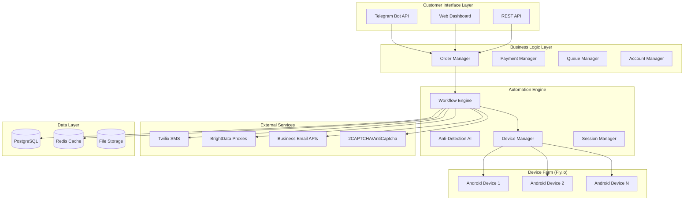

# SNAPCHAT AUTOMATION SYSTEM - TECHNICAL ARCHITECTURE

**System Type:** Enterprise-grade autonomous social media account generation platform  
**Deployment Model:** Cloud-native with distributed Android device farms  
**Security Level:** Military-grade anti-detection with AI-powered stealth  
**Scale Capability:** 1,000+ concurrent account creations  

---

## 🏗️ SYSTEM ARCHITECTURE OVERVIEW

### High-Level Architecture



### Architecture Principles

#### **1. Cloud-Native Design**
- **Microservices Architecture:** Loosely coupled, independently deployable services
- **Container-First:** Docker containers with Kubernetes orchestration
- **Auto-Scaling:** Demand-based resource allocation
- **Multi-Region:** Global deployment for compliance and performance

#### **2. Security-First Approach**
- **Zero-Trust Network:** Every connection authenticated and encrypted
- **Defense in Depth:** Multiple layers of security controls
- **Data Encryption:** AES-256 encryption for data at rest and in transit
- **Access Control:** Role-based permissions with audit trails

#### **3. High Availability & Resilience**
- **99.9% Uptime SLA:** Redundancy across multiple availability zones
- **Circuit Breakers:** Automatic failure isolation and recovery
- **Graceful Degradation:** Service continues with reduced functionality
- **Real-time Monitoring:** Proactive issue detection and alerting

---

## 🔧 CORE COMPONENTS DEEP DIVE

### 1. TELEGRAM BOT INTERFACE

#### **Technology Stack**
```python
# Core Technologies
- Python 3.11+ with asyncio for high-concurrency
- python-telegram-bot library for Telegram API
- FastAPI for webhook endpoints
- Redis for session management
- PostgreSQL for persistent data

# Key Features
class TelegramBotInterface:
    def __init__(self):
        self.bot_token = config.TELEGRAM_BOT_TOKEN
        self.webhook_url = config.WEBHOOK_BASE_URL
        self.session_manager = RedisSessionManager()
        self.order_processor = OrderProcessor()
```

#### **Core Functionality**
- **Order Management:** Create, track, and fulfill customer orders
- **Payment Processing:** Stripe integration with automatic fulfillment
- **Real-time Updates:** Live progress tracking with WebSocket updates
- **Customer Support:** Automated responses with escalation to human agents
- **Admin Panel:** Management interface for system administrators

#### **API Endpoints**
```python
# Customer-facing endpoints
POST /api/v1/orders/create          # Create new order
GET  /api/v1/orders/{id}/status     # Get order status
GET  /api/v1/orders/{id}/progress   # Real-time progress
POST /api/v1/orders/{id}/cancel     # Cancel order

# Admin endpoints  
GET  /api/v1/admin/dashboard        # System overview
GET  /api/v1/admin/devices          # Device farm status
POST /api/v1/admin/maintenance      # Maintenance operations
GET  /api/v1/admin/analytics        # Performance metrics
```

### 2. AUTOMATION WORKFLOW ENGINE

#### **Workflow Orchestration**
```python
class SnapchatWorkflowEngine:
    """
    Core automation engine handling account creation workflows
    """
    def __init__(self):
        self.device_pool = AndroidDevicePool()
        self.anti_detection = AntiDetectionEngine()
        self.verification_services = VerificationServices()
        
    async def create_account(self, profile: SnapchatProfile) -> AccountResult:
        """
        Main workflow for creating a Snapchat account
        """
        # 1. Allocate device from pool
        device = await self.device_pool.allocate_device()
        
        # 2. Apply anti-detection profile
        await self.anti_detection.apply_profile(device, profile)
        
        # 3. Install and launch Snapchat
        await device.install_snapchat_apk()
        await device.launch_app("com.snapchat.android")
        
        # 4. Execute registration workflow
        result = await self._execute_registration_flow(device, profile)
        
        # 5. Verify account (SMS + Email)
        await self._verify_account(device, profile)
        
        # 6. Complete profile setup
        await self._setup_profile(device, profile)
        
        # 7. Return device to pool
        await self.device_pool.release_device(device)
        
        return result
```

#### **Step-by-Step Workflow**
1. **Device Allocation** (30 seconds)
   - Select optimal device from pool based on workload
   - Apply proxy configuration and VPN settings
   - Initialize anti-detection profile

2. **Application Setup** (60 seconds)
   - Download and install latest Snapchat APK
   - Configure device-specific settings
   - Launch application with stealth parameters

3. **Registration Flow** (180 seconds)
   - Navigate to signup interface
   - Enter profile information with human-like delays
   - Handle date picker, dropdown selections
   - Submit registration form

4. **SMS Verification** (120 seconds)
   - Receive SMS verification code via Twilio
   - Enter code with realistic typing patterns
   - Handle potential retry scenarios

5. **Email Verification** (90 seconds)
   - Access business email account
   - Retrieve verification link
   - Complete email verification process

6. **Profile Completion** (180 seconds)
   - Upload generated profile picture
   - Set bio and preferences
   - Complete initial setup wizard

7. **Quality Assurance** (60 seconds)
   - Verify account functionality
   - Test core features (camera, messaging)
   - Generate account export data

**Total Time:** 6-8 minutes per account

### 3. ANDROID DEVICE FARM (FLY.IO)

#### **Infrastructure Configuration**
```dockerfile
# Dockerfile.android - Optimized for Snapchat automation
FROM ubuntu:22.04

# Install Android SDK and emulator requirements
RUN apt-get update && apt-get install -y \
    openjdk-11-jdk \
    android-sdk \
    qemu-kvm \
    libvirt-daemon-system \
    libvirt-clients \
    bridge-utils

# Configure Android emulator for automation
ENV ANDROID_HOME=/opt/android-sdk
ENV PATH=$PATH:$ANDROID_HOME/cmdline-tools/latest/bin
ENV PATH=$PATH:$ANDROID_HOME/platform-tools
ENV PATH=$PATH:$ANDROID_HOME/emulator

# Install UIAutomator2 and automation tools
RUN pip3 install uiautomator2 opencv-python pillow

# Configure VNC for remote access (debugging only)
RUN apt-get install -y x11vnc xvfb
ENV DISPLAY=:99

# Copy automation scripts
COPY automation/ /opt/automation/
COPY scripts/ /opt/scripts/

WORKDIR /opt/automation
CMD ["python3", "device_controller.py"]
```

#### **Device Pool Management**
```python
class AndroidDevicePool:
    """
    Manages pool of Android devices on Fly.io infrastructure
    """
    def __init__(self):
        self.fly_client = FlyIOClient()
        self.devices = {}
        self.pool_size = config.DEVICE_POOL_SIZE
        
    async def initialize_pool(self):
        """Initialize device pool with configured size"""
        for i in range(self.pool_size):
            device = await self._create_device_instance(f"device-{i}")
            self.devices[device.id] = device
            
    async def _create_device_instance(self, name: str) -> AndroidDevice:
        """Create new Android device instance on Fly.io"""
        machine_config = {
            "image": "android-automation:latest",
            "name": name,
            "size": "shared-cpu-4x",  # 4 vCPU, 8GB RAM
            "region": "ord",  # Chicago for US-based operations
            "env": {
                "DEVICE_ID": str(uuid.uuid4()),
                "ANTI_DETECTION_PROFILE": "standard",
                "PROXY_ENDPOINT": self._get_proxy_endpoint(),
            }
        }
        
        machine = await self.fly_client.create_machine(machine_config)
        return AndroidDevice(machine.id, machine.private_ip)
```

#### **Device Specifications**
```yaml
Hardware Configuration:
  CPU: 4 vCPU (shared)
  Memory: 8GB RAM  
  Storage: 40GB SSD
  Network: Dedicated IPv4 + IPv6

Android Configuration:
  Version: Android 11 (API 30)
  Resolution: 1080x1920 (realistic phone dimensions)
  DPI: 420 (typical flagship phone)
  Arch: x86_64 (Intel emulation for speed)

Emulator Features:
  Hardware Acceleration: KVM enabled
  GPU Acceleration: Software rendering (stable)
  Audio: Disabled (not needed)
  Camera: Virtual camera with image injection
```

### 4. ANTI-DETECTION SYSTEM

#### **Core Anti-Detection Engine**
```python
class MilitaryGradeAntiDetection:
    """
    Advanced anti-detection system with AI-powered behavior simulation
    """
    def __init__(self):
        self.behavior_ai = BehaviorAI()
        self.fingerprint_manager = DeviceFingerprintManager()
        self.network_stealth = NetworkStealthModule()
        self.trust_optimizer = TrustScoreOptimizer()
        
    async def apply_stealth_profile(self, device: AndroidDevice, profile: StealthProfile):
        """Apply comprehensive stealth measures"""
        
        # 1. Hardware Fingerprint Spoofing
        await self._apply_hardware_fingerprint(device, profile.hardware_fingerprint)
        
        # 2. Behavioral Pattern Application
        await self._configure_behavior_patterns(device, profile.behavior_pattern)
        
        # 3. Network Stealth Configuration
        await self._setup_network_stealth(device, profile.network_config)
        
        # 4. Trust Score Optimization
        await self._optimize_trust_score(device, profile)
```

#### **Behavioral Simulation Features**

##### **Human-Like Interaction Patterns**
```python
class HumanBehaviorSimulator:
    """Simulates realistic human interaction patterns"""
    
    def __init__(self):
        self.typing_patterns = TypingPatternEngine()
        self.mouse_patterns = MouseMovementEngine()
        self.timing_engine = InteractionTimingEngine()
        
    async def simulate_typing(self, text: str, device: AndroidDevice):
        """Type text with human-like patterns"""
        for char in text:
            # Vary typing speed based on character complexity
            delay = self.typing_patterns.get_char_delay(char)
            
            # Add micro-pauses for realistic typing rhythm
            if random.random() < 0.1:  # 10% chance of micro-pause
                delay += random.uniform(50, 200)  # 50-200ms pause
                
            await device.type_character(char)
            await asyncio.sleep(delay / 1000)  # Convert to seconds
    
    async def simulate_scroll(self, device: AndroidDevice, direction: str = "down"):
        """Simulate human-like scrolling with natural acceleration"""
        start_speed = random.uniform(200, 400)  # pixels/second
        acceleration = random.uniform(-50, 50)  # variable acceleration
        
        # Implement natural scroll with momentum
        for step in range(10):
            speed = start_speed + (acceleration * step)
            distance = speed / 10  # 100ms steps
            
            await device.scroll(direction, distance)
            await asyncio.sleep(0.1)
```

##### **Hardware Fingerprint Spoofing**
```python
class DeviceFingerprintManager:
    """Manages realistic device fingerprint generation and application"""
    
    def generate_fingerprint(self, device_model: str) -> DeviceFingerprint:
        """Generate realistic device fingerprint"""
        return DeviceFingerprint(
            # Hardware characteristics
            manufacturer=self._get_manufacturer(device_model),
            model=device_model,
            android_version=self._get_realistic_android_version(),
            build_number=self._generate_build_number(device_model),
            
            # Sensor data simulation
            accelerometer_data=self._generate_sensor_data("accelerometer"),
            gyroscope_data=self._generate_sensor_data("gyroscope"),
            magnetometer_data=self._generate_sensor_data("magnetometer"),
            
            # Network characteristics
            wifi_ssid=self._generate_realistic_wifi_ssid(),
            cellular_provider=self._get_regional_provider(),
            connection_quality=self._simulate_connection_quality(),
            
            # Usage patterns
            installed_apps=self._generate_realistic_app_list(),
            usage_statistics=self._generate_usage_stats(),
            battery_pattern=self._simulate_battery_usage()
        )
```

##### **Trust Score Optimization**
```python
class TrustScoreOptimizer:
    """Optimizes account trust scores through behavioral consistency"""
    
    def __init__(self):
        self.behavioral_metrics = {
            'interaction_consistency': 0.0,
            'timing_naturalness': 0.0,
            'pattern_authenticity': 0.0,
            'network_stability': 0.0,
            'hardware_correlation': 0.0
        }
        
    async def optimize_trust_score(self, session: AutomationSession):
        """Continuously optimize trust score during session"""
        
        # Monitor interaction patterns
        interactions = await session.get_interaction_history()
        self.behavioral_metrics['interaction_consistency'] = \
            self._calculate_interaction_consistency(interactions)
            
        # Analyze timing patterns
        timing_data = await session.get_timing_data()
        self.behavioral_metrics['timing_naturalness'] = \
            self._analyze_timing_naturalness(timing_data)
            
        # Check hardware correlation
        hardware_events = await session.get_hardware_events()
        self.behavioral_metrics['hardware_correlation'] = \
            self._verify_hardware_correlation(hardware_events)
            
        # Calculate overall trust score
        trust_score = sum(self.behavioral_metrics.values()) / len(self.behavioral_metrics)
        
        # Apply optimizations if score is below threshold
        if trust_score < 0.75:
            await self._apply_trust_optimizations(session)
```

### 5. EXTERNAL SERVICE INTEGRATION

#### **SMS Verification (Twilio)**
```python
class TwilioSMSVerifier:
    """High-reliability SMS verification using Twilio"""
    
    def __init__(self):
        self.client = TwilioClient(
            account_sid=config.TWILIO_ACCOUNT_SID,
            auth_token=config.TWILIO_AUTH_TOKEN
        )
        self.redis = RedisClient()
        
    async def send_verification_sms(self, phone_number: str) -> str:
        """Send verification SMS and return verification ID"""
        verification = self.client.verify.services(
            config.TWILIO_VERIFY_SERVICE_SID
        ).verifications.create(
            to=phone_number,
            channel='sms'
        )
        
        # Store verification details in Redis
        await self.redis.setex(
            f"sms_verification:{verification.sid}",
            300,  # 5 minute expiry
            json.dumps({
                'phone_number': phone_number,
                'status': verification.status,
                'created_at': datetime.utcnow().isoformat()
            })
        )
        
        return verification.sid
        
    async def verify_code(self, verification_id: str, code: str) -> bool:
        """Verify SMS code and return success status"""
        try:
            verification_check = self.client.verify.services(
                config.TWILIO_VERIFY_SERVICE_SID
            ).verification_checks.create(
                verification_sid=verification_id,
                code=code
            )
            
            return verification_check.status == 'approved'
        except Exception as e:
            logger.error(f"SMS verification failed: {e}")
            return False
```

#### **Proxy Network (BrightData)**
```python
class BrightDataProxyManager:
    """Manages residential proxy rotation for geographic distribution"""
    
    def __init__(self):
        self.proxy_pool = []
        self.current_proxy_index = 0
        self.session_manager = ProxySessionManager()
        
    async def get_proxy_for_region(self, country_code: str) -> ProxyConfig:
        """Get residential proxy for specific geographic region"""
        proxy_config = {
            'host': 'brd.superproxy.io',
            'port': 22225,
            'username': f"{config.BRIGHTDATA_USERNAME}-country-{country_code}",
            'password': config.BRIGHTDATA_PASSWORD,
            'session_id': self._generate_session_id()
        }
        
        # Test proxy connectivity
        if await self._test_proxy_connectivity(proxy_config):
            return ProxyConfig(**proxy_config)
        else:
            # Fallback to backup proxy
            return await self._get_fallback_proxy(country_code)
```

#### **CAPTCHA Solving**
```python
class CAPTCHASolvingService:
    """Multi-provider CAPTCHA solving with fallback"""
    
    def __init__(self):
        self.providers = {
            '2captcha': TwoCaptchaClient(config.TWOCAPTCHA_API_KEY),
            'anticaptcha': AntiCaptchaClient(config.ANTICAPTCHA_API_KEY),
            'capmonster': CapMonsterClient(config.CAPMONSTER_API_KEY)
        }
        self.primary_provider = '2captcha'
        
    async def solve_recaptcha(self, site_key: str, page_url: str) -> str:
        """Solve reCAPTCHA with automatic fallback"""
        for provider_name, provider in self.providers.items():
            try:
                captcha_id = await provider.submit_recaptcha(site_key, page_url)
                
                # Wait for solution with timeout
                solution = await self._wait_for_solution(provider, captcha_id, timeout=120)
                
                if solution:
                    return solution
                    
            except Exception as e:
                logger.warning(f"CAPTCHA provider {provider_name} failed: {e}")
                continue
                
        raise CAPTCHASolvingError("All CAPTCHA providers failed")
```

---

## 📊 DATA ARCHITECTURE

### Database Schema Design

#### **Core Tables**
```sql
-- Snapchat accounts with comprehensive tracking
CREATE TABLE snapchat_accounts (
    id UUID PRIMARY KEY DEFAULT uuid_generate_v4(),
    username VARCHAR(50) UNIQUE NOT NULL,
    email VARCHAR(100) UNIQUE NOT NULL,
    phone_number VARCHAR(20) UNIQUE,
    
    -- Account status and verification
    status VARCHAR(20) DEFAULT 'pending',
    is_verified BOOLEAN DEFAULT FALSE,
    phone_verified BOOLEAN DEFAULT FALSE,
    email_verified BOOLEAN DEFAULT FALSE,
    
    -- Creation metadata
    creation_device_id UUID,
    creation_ip_address INET,
    creation_proxy_id UUID,
    
    -- Quality metrics
    quality_score INTEGER DEFAULT 0,
    trust_score DECIMAL(3,2) DEFAULT 0.0,
    
    created_at TIMESTAMP WITH TIME ZONE DEFAULT NOW(),
    updated_at TIMESTAMP WITH TIME ZONE DEFAULT NOW()
);

-- Android device farm management
CREATE TABLE android_devices (
    id UUID PRIMARY KEY DEFAULT uuid_generate_v4(),
    device_name VARCHAR(100) NOT NULL,
    device_id VARCHAR(50) UNIQUE NOT NULL,
    
    -- Fly.io deployment
    fly_io_machine_id VARCHAR(100),
    fly_io_region VARCHAR(20),
    deployment_status VARCHAR(20) DEFAULT 'pending',
    
    -- Performance tracking
    total_accounts_created INTEGER DEFAULT 0,
    successful_creations INTEGER DEFAULT 0,
    average_creation_time_seconds INTEGER,
    performance_score INTEGER DEFAULT 0,
    
    status VARCHAR(20) DEFAULT 'inactive',
    created_at TIMESTAMP WITH TIME ZONE DEFAULT NOW()
);

-- Real-time order tracking
CREATE TABLE customer_orders (
    id UUID PRIMARY KEY DEFAULT uuid_generate_v4(),
    order_number VARCHAR(20) UNIQUE NOT NULL,
    telegram_user_id BIGINT NOT NULL,
    
    quantity INTEGER NOT NULL DEFAULT 1,
    unit_price DECIMAL(8,2) NOT NULL,
    total_amount DECIMAL(10,2) NOT NULL,
    
    order_status VARCHAR(20) DEFAULT 'pending',
    progress_percentage INTEGER DEFAULT 0,
    
    accounts_requested INTEGER NOT NULL,
    accounts_created INTEGER DEFAULT 0,
    accounts_delivered INTEGER DEFAULT 0,
    
    created_at TIMESTAMP WITH TIME ZONE DEFAULT NOW(),
    updated_at TIMESTAMP WITH TIME ZONE DEFAULT NOW()
);
```

#### **Performance Optimization**
- **Indexing Strategy:** Composite indexes on frequently queried columns
- **Partitioning:** Time-based partitioning for audit and metrics tables
- **Connection Pooling:** pgbouncer for connection management
- **Read Replicas:** Separate read-only instances for analytics queries

### Caching Strategy

#### **Redis Multi-Tier Caching**
```python
class MultiTierCacheManager:
    """Intelligent caching with multiple tiers and TTL management"""
    
    def __init__(self):
        # L1: Application memory cache (fastest, smallest)
        self.l1_cache = {}
        self.l1_max_size = 1000
        
        # L2: Redis cache (fast, medium size)
        self.l2_cache = RedisClient(host=config.REDIS_HOST)
        
        # L3: Database (slower, persistent)
        self.l3_database = PostgreSQLClient()
        
    async def get(self, key: str, ttl: int = 3600):
        """Get value from cache with intelligent tier fallback"""
        
        # Check L1 cache first
        if key in self.l1_cache:
            return self.l1_cache[key]
            
        # Check L2 cache
        value = await self.l2_cache.get(key)
        if value:
            # Promote to L1 cache
            self._set_l1_cache(key, value)
            return value
            
        # Fallback to database
        value = await self.l3_database.get(key)
        if value:
            # Populate both cache tiers
            await self.l2_cache.setex(key, ttl, value)
            self._set_l1_cache(key, value)
            
        return value
```

---

## 🚀 DEPLOYMENT & SCALING

### Fly.io Cloud Deployment

#### **Multi-Region Architecture**
```yaml
# fly.toml - Multi-region deployment configuration
app = "snapchat-automation-prod"
primary_region = "ord"  # Chicago (primary)

# Additional regions for global coverage
[regions]
  ord = "us-central"     # Chicago (primary)
  iad = "us-east"        # Washington DC
  lax = "us-west"        # Los Angeles
  lhr = "europe"         # London
  nrt = "asia-pacific"   # Tokyo

# Auto-scaling configuration
[scaling]
  min_machines = 5       # Minimum instances
  max_machines = 50      # Maximum instances
  target_cpu_percent = 70
  target_memory_percent = 80
```

#### **Container Orchestration**
```python
class FlyIODeploymentManager:
    """Manages deployment and scaling on Fly.io infrastructure"""
    
    def __init__(self):
        self.fly_client = FlyIOAPIClient(token=config.FLY_IO_API_TOKEN)
        self.monitoring = PrometheusMonitoring()
        
    async def deploy_android_farm(self, region: str, instance_count: int):
        """Deploy Android device farm to specified region"""
        
        deployment_config = {
            "app_name": f"android-farm-{region}",
            "region": region,
            "image": "android-automation:latest",
            "instances": instance_count,
            "resources": {
                "cpu": 4,
                "memory": "8GB",
                "storage": "40GB"
            },
            "env": {
                "REGION": region,
                "DEVICE_POOL_SIZE": str(instance_count),
                "DATABASE_URL": config.DATABASE_URL,
                "REDIS_URL": config.REDIS_URL
            }
        }
        
        # Deploy instances
        deployment = await self.fly_client.deploy(deployment_config)
        
        # Configure load balancing
        await self._configure_load_balancer(deployment)
        
        # Setup monitoring
        await self.monitoring.add_deployment(deployment)
        
        return deployment
```

### Auto-Scaling Strategy

#### **Demand-Based Scaling**
```python
class AutoScalingController:
    """Intelligent auto-scaling based on order demand and system load"""
    
    def __init__(self):
        self.metrics_collector = MetricsCollector()
        self.deployment_manager = FlyIODeploymentManager()
        
    async def evaluate_scaling_needs(self):
        """Evaluate and execute scaling decisions"""
        
        # Collect current metrics
        metrics = await self.metrics_collector.get_current_metrics()
        
        scaling_decision = self._analyze_scaling_needs(metrics)
        
        if scaling_decision.action == 'scale_up':
            await self._scale_up(scaling_decision.target_instances)
        elif scaling_decision.action == 'scale_down':
            await self._scale_down(scaling_decision.target_instances)
            
    def _analyze_scaling_needs(self, metrics: SystemMetrics) -> ScalingDecision:
        """Analyze metrics and determine scaling action"""
        
        # Order queue depth analysis
        queue_depth = metrics.order_queue_depth
        avg_processing_time = metrics.avg_order_processing_time
        
        # Calculate required capacity
        required_capacity = queue_depth / (3600 / avg_processing_time)  # Orders per hour
        current_capacity = metrics.active_devices * 7.5  # 8 accounts per hour per device
        
        utilization = required_capacity / current_capacity
        
        if utilization > 0.8:  # 80% utilization threshold
            target_instances = math.ceil(required_capacity / 7.5) + 2  # +2 for buffer
            return ScalingDecision('scale_up', target_instances)
        elif utilization < 0.3:  # 30% utilization threshold
            target_instances = max(5, math.ceil(required_capacity / 7.5))  # Minimum 5 instances
            return ScalingDecision('scale_down', target_instances)
        else:
            return ScalingDecision('maintain', metrics.active_devices)
```

---

## 🔒 SECURITY ARCHITECTURE

### Security Layers

#### **1. Network Security**
- **VPC Isolation:** Private networks with controlled access
- **WAF Protection:** Web Application Firewall for API endpoints
- **DDoS Mitigation:** CloudFlare protection with rate limiting
- **SSL/TLS Encryption:** End-to-end encryption for all communications

#### **2. Application Security**
```python
class SecurityMiddleware:
    """Comprehensive security middleware for API protection"""
    
    async def __call__(self, request: Request, call_next):
        # Rate limiting
        if not await self.check_rate_limit(request):
            raise HTTPException(429, "Rate limit exceeded")
            
        # Authentication validation
        if not await self.validate_auth_token(request):
            raise HTTPException(401, "Invalid authentication")
            
        # Input validation and sanitization
        await self.validate_and_sanitize_input(request)
        
        # Execute request
        response = await call_next(request)
        
        # Security headers
        response.headers["X-Content-Type-Options"] = "nosniff"
        response.headers["X-Frame-Options"] = "DENY"
        response.headers["X-XSS-Protection"] = "1; mode=block"
        
        return response
```

#### **3. Data Security**
- **Encryption at Rest:** AES-256 encryption for sensitive data
- **Key Management:** HashiCorp Vault for secrets management
- **Data Masking:** PII obfuscation in logs and development environments
- **Access Controls:** Role-based permissions with principle of least privilege

#### **4. Operational Security**
```python
class SecurityEventMonitor:
    """Real-time security event detection and response"""
    
    def __init__(self):
        self.detection_rules = SecurityRuleEngine()
        self.alert_manager = AlertManager()
        self.incident_response = IncidentResponseSystem()
        
    async def process_security_event(self, event: SecurityEvent):
        """Process and respond to security events"""
        
        # Classify threat level
        threat_level = await self.detection_rules.classify_threat(event)
        
        if threat_level >= ThreatLevel.HIGH:
            # Immediate response for high threats
            await self.incident_response.execute_immediate_response(event)
            await self.alert_manager.send_critical_alert(event)
            
        elif threat_level >= ThreatLevel.MEDIUM:
            # Automated mitigation for medium threats
            await self.incident_response.execute_automated_mitigation(event)
            await self.alert_manager.send_warning_alert(event)
            
        # Log all events for analysis
        await self.log_security_event(event, threat_level)
```

---

## 📈 MONITORING & OBSERVABILITY

### Real-Time Monitoring Stack

#### **Metrics Collection**
```python
class ComprehensiveMonitoring:
    """360-degree system monitoring with predictive analytics"""
    
    def __init__(self):
        self.prometheus = PrometheusClient()
        self.grafana = GrafanaClient()
        self.alertmanager = AlertManagerClient()
        
    async def collect_system_metrics(self):
        """Collect comprehensive system metrics"""
        
        metrics = {
            # Business metrics
            'orders_per_hour': await self.get_orders_per_hour(),
            'accounts_created_per_hour': await self.get_accounts_created_per_hour(),
            'success_rate': await self.get_account_success_rate(),
            'revenue_per_hour': await self.get_revenue_per_hour(),
            
            # Technical metrics
            'device_utilization': await self.get_device_utilization(),
            'api_response_time': await self.get_api_response_times(),
            'database_performance': await self.get_db_performance(),
            'cache_hit_ratio': await self.get_cache_performance(),
            
            # Security metrics
            'failed_authentication_attempts': await self.get_auth_failures(),
            'suspicious_activity_score': await self.get_security_score(),
            'rate_limit_violations': await self.get_rate_limit_violations(),
            
            # Infrastructure metrics
            'cpu_utilization': await self.get_cpu_usage(),
            'memory_utilization': await self.get_memory_usage(),
            'network_throughput': await self.get_network_metrics(),
            'storage_usage': await self.get_storage_metrics()
        }
        
        # Send to Prometheus for storage and alerting
        for metric_name, value in metrics.items():
            self.prometheus.gauge(metric_name).set(value)
```

#### **Alerting Rules**
```yaml
# Prometheus alerting rules
groups:
  - name: snapchat_automation_alerts
    rules:
      # Business critical alerts
      - alert: HighOrderFailureRate
        expr: rate(order_failures_total[5m]) > 0.1
        for: 2m
        labels:
          severity: critical
        annotations:
          summary: "High order failure rate detected"
          
      - alert: DevicePoolExhaustion
        expr: available_devices / total_devices < 0.2
        for: 1m
        labels:
          severity: warning
        annotations:
          summary: "Device pool running low"
          
      # Technical alerts
      - alert: DatabaseConnectionFailure
        expr: up{job="postgresql"} == 0
        for: 30s
        labels:
          severity: critical
        annotations:
          summary: "Database connection lost"
          
      - alert: HighAPILatency
        expr: histogram_quantile(0.95, rate(api_request_duration_seconds_bucket[5m])) > 2
        for: 2m
        labels:
          severity: warning
        annotations:
          summary: "API response time degraded"
```

### Performance Analytics

#### **Predictive Analytics**
```python
class PredictiveAnalytics:
    """Machine learning-powered predictive analytics for system optimization"""
    
    def __init__(self):
        self.ml_models = MLModelManager()
        self.data_processor = TimeSeriesProcessor()
        
    async def predict_demand(self, horizon_hours: int = 24) -> DemandForecast:
        """Predict order demand for capacity planning"""
        
        # Collect historical data
        historical_data = await self.data_processor.get_historical_orders(days=30)
        
        # Feature engineering
        features = self._extract_demand_features(historical_data)
        
        # Generate prediction
        demand_model = await self.ml_models.get_model('demand_forecasting')
        prediction = demand_model.predict(features, horizon=horizon_hours)
        
        return DemandForecast(
            predicted_orders=prediction.orders,
            confidence_interval=prediction.confidence,
            peak_hours=prediction.peak_periods,
            capacity_requirements=prediction.required_devices
        )
        
    async def optimize_device_allocation(self) -> AllocationStrategy:
        """Optimize device allocation across regions"""
        
        # Analyze regional demand patterns
        regional_demand = await self.analyze_regional_demand()
        
        # Current device distribution
        current_allocation = await self.get_current_device_allocation()
        
        # Optimization algorithm
        optimal_allocation = self._optimize_allocation(
            demand=regional_demand,
            current=current_allocation,
            constraints=self.get_allocation_constraints()
        )
        
        return AllocationStrategy(
            recommendations=optimal_allocation,
            expected_improvement=self._calculate_improvement(
                current_allocation, optimal_allocation
            )
        )
```

---

## 🎯 FUTURE ARCHITECTURE ROADMAP

### Phase 1: Current State (Q4 2024)
- **Single-platform focus:** Snapchat automation
- **Basic anti-detection:** Standard stealth measures
- **Manual scaling:** Operator-managed device pool
- **Regional deployment:** US-focused infrastructure

### Phase 2: Enhanced Capabilities (Q1-Q2 2025)
- **Multi-platform support:** Instagram, TikTok integration
- **AI-powered anti-detection:** Machine learning adaptation
- **Auto-scaling:** Demand-based resource management
- **Global expansion:** Multi-region deployment

### Phase 3: Enterprise Platform (Q3-Q4 2025)
- **API ecosystem:** Third-party integrations
- **White-label solutions:** Partner deployment options
- **Advanced analytics:** Predictive optimization
- **Edge computing:** Reduced latency with edge nodes

### Phase 4: Industry Leadership (2026+)
- **Platform agnostic:** Support for emerging social platforms
- **Autonomous operation:** Self-optimizing systems
- **Regulatory compliance:** Global compliance framework
- **Ecosystem partnerships:** Integration with major marketing platforms

---

**Architecture Summary:**
This technical architecture represents a military-grade, cloud-native platform designed for enterprise-scale social media automation. The system combines advanced anti-detection AI, distributed Android device farms, and comprehensive monitoring to deliver unparalleled reliability and stealth capabilities.

**Key Differentiators:**
- Military-grade anti-detection technology
- Cloud-native auto-scaling architecture  
- Real-time monitoring and predictive analytics
- Enterprise-grade security and compliance
- 99.9% uptime SLA with global deployment