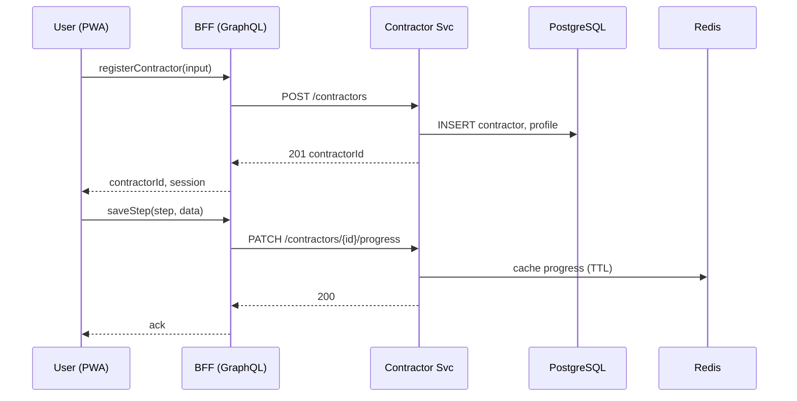
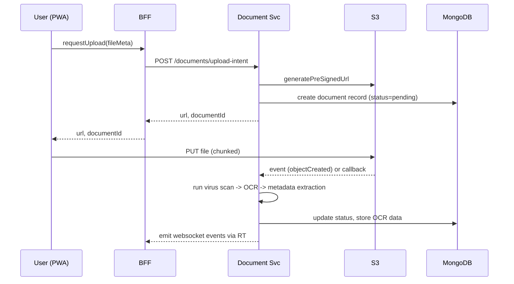
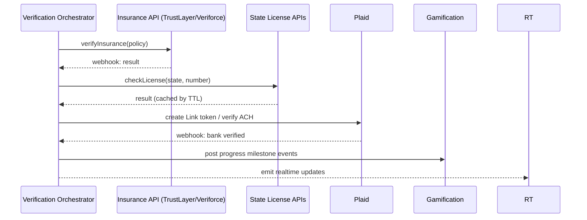

# System Architecture

This document defines the high-level architecture for the Contractor Registration System powering the Christmas light marketplace. It covers services, data flow, technology choices, reliability, security boundaries, and scalability considerations.

## Goals and Non-Goals

- Goals: secure onboarding, automated verification, real-time progress, offline-capable PWA, horizontal scalability for seasonal load, strong observability.
- Non-goals: full feature specs for UX copy or backoffice admin (covered elsewhere).

## High-Level Diagram

```mermaid
flowchart LR
  subgraph Client
    PWA[Next.js + React PWA]
  end

  PWA -- HTTPS/HTTP2 --> CDN[Cloudflare CDN]
  CDN -- SSR/API --> BFF[Next.js API routes / GraphQL Gateway]
  BFF --> GW[Kong API Gateway (AuthN/Z, rate limits)]

  GW --> AUTH[Auth0]
  GW --> CTR[Contractor Service]
  GW --> DOC[Document Service]
  GW --> VER[Verification Orchestrator]
  GW --> GAM[Gamification Service]
  GW --> NOTIF[Notification Service]
  PWA <-- Socket.io --> RT[Realtime Service]

  subgraph Data Stores
    PG[(PostgreSQL)]
    MG[(MongoDB)]
    S3[(AWS S3)]
    REDIS[(Redis)]
  end

  CTR <--> PG
  DOC <--> MG
  DOC <--> S3
  VER <--> PG
  VER <--> MG
  BFF <--> REDIS

  VER --> EXT1[TrustLayer/Veriforce]
  VER --> EXT2[State License APIs]
  VER --> EXT3[Plaid]
  NOTIF --> SG[SendGrid]
```

## Core Services

- BFF and GraphQL Gateway (Next.js API routes + Apollo Server)
  - Aggregates REST microservices into a typed GraphQL API for the frontend
  - Provides SSR/SSG for public and authenticated pages
  - Issues S3 pre-signed URLs for uploads via Document Service

- Contractor Service (Node.js + Express)
  - Manages contractor accounts, profiles, progress state, and onboarding lifecycle
  - Stores structured data in PostgreSQL

- Document Service (Node.js + Express)
  - Handles file lifecycle: pre-sign, upload intents, virus scan, OCR dispatch, status tracking
  - Metadata and OCR payloads in MongoDB; blobs in S3 behind Cloudflare CDN

- Verification Orchestrator
  - Orchestrates insurance, license, and banking verifications
  - Consumes provider webhooks (TrustLayer, Veriforce, Plaid) and updates state idempotently
  - Emits realtime progress via Socket.io

- Realtime Service (Socket.io)
  - Authenticated WebSocket channels for per-contractor events
  - Scales via Redis adapter for multi-node pub/sub

- Gamification Service
  - Awards badges, milestones, and computes progress rings
  - Persists achievements and counters; pushes events to realtime

- Notification Service
  - Sends transactional emails via SendGrid
  - Template management and provider failover hooks

## Data Stores

- PostgreSQL: contractors, business profiles, licenses, insurance policies, bank verification status, gamification summaries, audit logs
- MongoDB: document metadata, OCR extraction results, verification payload snapshots, large JSON structures
- S3: original and derived document binaries (versioned, encrypted at rest)
- Redis: session management, rate-limiting counters, short-lived caches, Socket.io pub/sub

## API Boundary

- External ingress passes through Kong API Gateway for auth, rate limiting, and request normalization.
- BFF exposes GraphQL and limited REST endpoints to the PWA. Backend services communicate via REST/GraphQL over mTLS within the cluster.

## Key Data Flows

### 1) Registration & Progress



### 2) Document Upload & Processing



### 3) Verification Orchestration



## Scaling & Performance

- Horizontal scaling for all stateless services with Kubernetes HPA based on CPU/RPS and custom metrics
- CDN offload for static assets and uploads; SSR caching for public pages
- Redis caching for hot reads and ephemeral onboarding state
- Rate limiting and circuit breakers via Kong and service-level policies
- Idempotency keys on POST/PUT to handle retries safely

## Reliability & Failure Handling

- At-least-once processing for document pipeline with idempotent updates
- Dead-letter queues for failed OCR/verification steps
- Exponential backoff on third-party retries with jitter
- Graceful degradation to manual verification when providers are down

## Security Overview (see security.md)

- Auth0 OIDC with MFA; short-lived access tokens; refresh via silent re-auth
- mTLS between services; secrets in Secrets Manager; KMS for envelope encryption
- PII minimization and field-level encryption where required

## Observability

- Structured JSON logging with request correlation (traceId, userId, contractorId)
- Distributed tracing (OpenTelemetry) across BFF and services
- Metrics (RED/USE) with dashboards and SLOs; alerting on error rates and latency

## Environments & Deployment

- Environments: dev, staging, prod; feature flags for progressive delivery
- Infra as code with Terraform; blue/green or canary releases via GitOps/Argo Rollouts
- Multi-region active-active for read-heavy paths; active-passive for verification providers

## Configuration & Secrets

- 12-factor configuration via environment variables
- Secret rotation cadence and bootstrapped through KMS-backed secret stores

## Compliance Hooks

- GDPR/CCPA consent recording and data retention workflows
- Audit trails for sensitive actions and verification decisions

