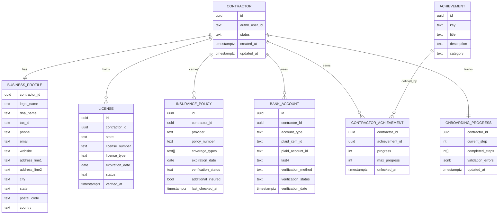

# Data Models and ERD

This document defines storage models across PostgreSQL, MongoDB, S3, and Redis, including relationships, indexes, and retention.

## PostgreSQL Schema (relational)

Key entities stored in PostgreSQL for strong consistency and relational integrity.

```sql
-- contractors and profile
CREATE TABLE contractor (
  id UUID PRIMARY KEY,
  auth0_user_id TEXT UNIQUE NOT NULL,
  status TEXT NOT NULL DEFAULT 'pending', -- pending|in_review|verified|rejected
  created_at TIMESTAMPTZ NOT NULL DEFAULT now(),
  updated_at TIMESTAMPTZ NOT NULL DEFAULT now()
);

CREATE TABLE business_profile (
  contractor_id UUID PRIMARY KEY REFERENCES contractor(id) ON DELETE CASCADE,
  legal_name TEXT NOT NULL,
  dba_name TEXT,
  tax_id TEXT, -- encrypted
  phone TEXT,
  email TEXT,
  website TEXT,
  address_line1 TEXT,
  address_line2 TEXT,
  city TEXT,
  state TEXT,
  postal_code TEXT,
  country TEXT DEFAULT 'US',
  created_at TIMESTAMPTZ NOT NULL DEFAULT now(),
  updated_at TIMESTAMPTZ NOT NULL DEFAULT now()
);

-- licenses and insurance
CREATE TABLE license (
  id UUID PRIMARY KEY,
  contractor_id UUID NOT NULL REFERENCES contractor(id) ON DELETE CASCADE,
  state TEXT NOT NULL,
  license_number TEXT NOT NULL,
  license_type TEXT,
  expiration_date DATE,
  status TEXT NOT NULL DEFAULT 'unverified', -- unverified|verified|expired
  verified_at TIMESTAMPTZ,
  UNIQUE(contractor_id, state, license_number)
);

CREATE TYPE insurance_coverage AS ENUM ('gl', 'wc', 'auto', 'umbrella');

CREATE TABLE insurance_policy (
  id UUID PRIMARY KEY,
  contractor_id UUID NOT NULL REFERENCES contractor(id) ON DELETE CASCADE,
  provider TEXT NOT NULL, -- trustlayer|veriforce|manual
  policy_number TEXT NOT NULL,
  coverage_types insurance_coverage[] NOT NULL,
  expiration_date DATE NOT NULL,
  verification_status TEXT NOT NULL DEFAULT 'pending', -- pending|verified|failed
  additional_insured BOOLEAN DEFAULT false,
  last_checked_at TIMESTAMPTZ
);

-- bank verification (no sensitive numbers in cleartext)
CREATE TABLE bank_account (
  id UUID PRIMARY KEY,
  contractor_id UUID NOT NULL REFERENCES contractor(id) ON DELETE CASCADE,
  account_type TEXT NOT NULL CHECK (account_type IN ('checking','savings')),
  plaid_item_id TEXT,
  plaid_account_id TEXT,
  last4 TEXT,
  verification_method TEXT NOT NULL CHECK (verification_method IN ('micro-deposit','instant','manual')),
  verification_status TEXT NOT NULL CHECK (verification_status IN ('pending','verified','failed')),
  verification_date TIMESTAMPTZ
);

-- gamification
CREATE TABLE achievement (
  id UUID PRIMARY KEY,
  key TEXT UNIQUE NOT NULL,
  title TEXT NOT NULL,
  description TEXT NOT NULL,
  category TEXT NOT NULL CHECK (category IN ('completion','quality','speed','referral'))
);

CREATE TABLE contractor_achievement (
  contractor_id UUID NOT NULL REFERENCES contractor(id) ON DELETE CASCADE,
  achievement_id UUID NOT NULL REFERENCES achievement(id) ON DELETE CASCADE,
  progress INTEGER NOT NULL DEFAULT 0,
  max_progress INTEGER NOT NULL DEFAULT 1,
  unlocked_at TIMESTAMPTZ,
  PRIMARY KEY (contractor_id, achievement_id)
);

-- audit
CREATE TABLE audit_log (
  id BIGSERIAL PRIMARY KEY,
  occurred_at TIMESTAMPTZ NOT NULL DEFAULT now(),
  actor_type TEXT NOT NULL, -- user|system
  actor_id TEXT,
  contractor_id UUID,
  action TEXT NOT NULL,
  details JSONB
);

-- progress state snapshot (fallback to Redis)
CREATE TABLE onboarding_progress (
  contractor_id UUID PRIMARY KEY REFERENCES contractor(id) ON DELETE CASCADE,
  current_step INTEGER NOT NULL DEFAULT 1,
  completed_steps INTEGER[] NOT NULL DEFAULT '{}',
  validation_errors JSONB,
  updated_at TIMESTAMPTZ NOT NULL DEFAULT now()
);

CREATE INDEX idx_license_contractor ON license(contractor_id);
CREATE INDEX idx_policy_contractor ON insurance_policy(contractor_id);
CREATE INDEX idx_bank_contractor ON bank_account(contractor_id);
CREATE INDEX idx_audit_contractor ON audit_log(contractor_id);
```

## MongoDB Collections (document storage)

- documents
  - fields: `_id`, `contractorId`, `type`, `status`, `s3Key`, `originalName`, `mimeType`, `fileSize`, `hash`, `ocrData`, `verificationStatus`, `createdAt`, `updatedAt`
  - indexes: `{ contractorId: 1, type: 1, createdAt: -1 }`, `{ s3Key: 1, unique: true }`

- verification_payloads
  - snapshot of provider webhooks/requests for audit and replay
  - indexes: `{ contractorId: 1, provider: 1, createdAt: -1 }`

## Redis Keys (ephemeral)

- `session:{auth0UserId}`: session data
- `progress:{contractorId}`: cached onboarding progress (TTL 24h)
- `ratelimit:{ip|user}`: sliding window counters
- `ws:rooms:{contractorId}`: websocket presence and room mapping

## ERD



## Data Retention & Compliance

- Documents: retained for required compliance windows; auto-delete derived PII on expiration
- Audit logs: 24 months minimum, configurable per Security policy
- Right-to-erasure workflows cascade across PostgreSQL, MongoDB, S3, and caches

