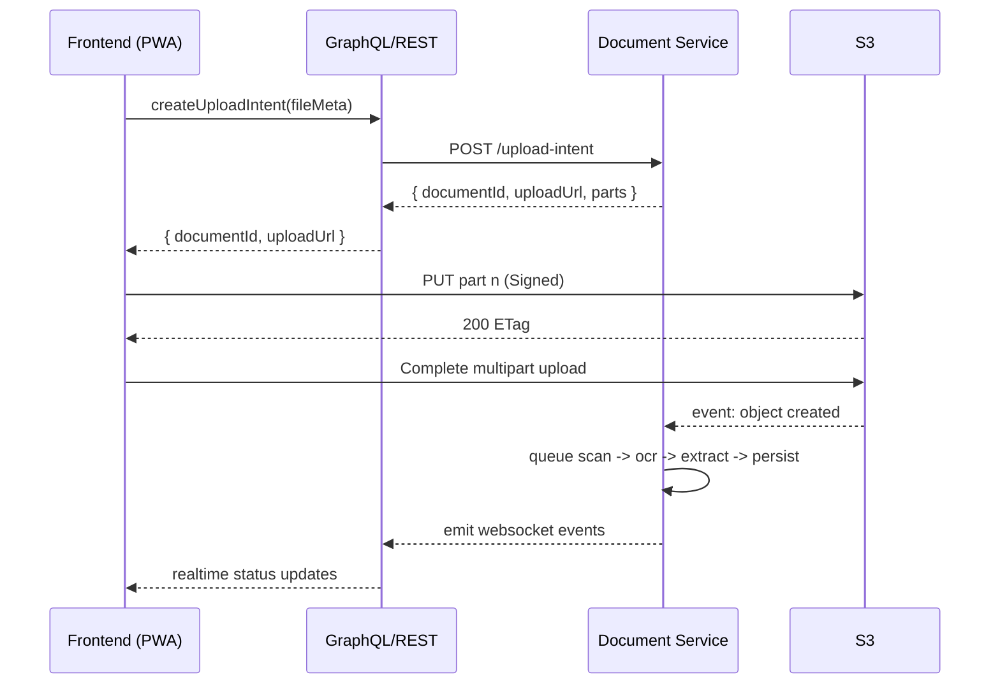
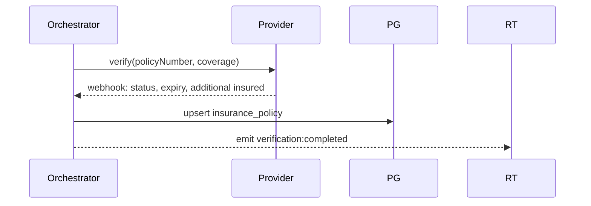

# Document Upload & Verification Pipelines

This document specifies file handling, resumable uploads, OCR, virus scanning, fraud checks, and external verification integrations.

## Upload Configuration

```ts
export interface DocumentUploadConfig {
  allowedTypes: string[];
  maxFileSize: number; // bytes
  maxFiles: number;
  compressionEnabled: boolean;
  virusScanning: boolean;
  ocrProcessing: boolean;
}

export interface UploadResponse {
  documentId: string;
  status: 'processing' | 'completed' | 'failed';
  ocrData?: Record<string, unknown>;
  verificationStatus?: { isValid: boolean; confidence: number; errors: string[] };
}
```

## Resumable Upload Flow



### Client Requirements

- Chunk files (5–10 MB parts); retry on 5xx; support pause/resume
- Capture from camera on mobile with orientation and compression before upload
- Calculate checksum (SHA-256) and include in intent for integrity checks

## Processing Stages

1. Virus Scan
   - ClamAV or third-party; quarantine on detection; notify user with remediation steps
2. OCR
   - HyperVerge/Veridas; extract text and structured fields (name, policy, expiration)
3. Metadata Extraction
   - File type detection, EXIF, image quality score, blur detection
4. Fraud Detection
   - Heuristics: tampering, copy-paste signatures, template mismatch, duplicate hash across accounts
5. Verification Update
   - Map OCR results to domain entities; update status and emit events

## Verification Orchestration

```ts
export interface DocumentProcessor {
  extractText(file: File): Promise<{ text: string; fields: Record<string, string> }>;
  validateFormat(document: unknown): Promise<{ ok: boolean; errors: string[] }>;
  detectFraud(document: unknown): Promise<{ score: number; reasons: string[] }>;
  extractMetadata(file: File): Promise<Record<string, unknown>>;
}
```

### Insurance Verification

- Providers: TrustLayer, Veriforce; webhook results are authoritative
- Store provider payload snapshots in MongoDB for audit
- Reconcile by policy number + contractor; mark idempotently



### State License Validation

- Integrate per-state APIs where available; cache results per license for TTL (e.g., 24h)
- Fallback to manual review and schedule periodic re-checks

### Bank Verification (Plaid)

- Create Link token; exchange public token; receive webhooks on verification
- Store only Plaid item/account ids and last4; never store full routing/account numbers

## Error Handling & Recovery

- Retries with exponential backoff and jitter for provider calls (max attempts configurable)
- Dead-letter queue for OCR/verification failures with triage dashboard
- Partial upload resume via multipart; client retries only idempotent operations

## Security Considerations

- Pre-signed URLs with least privileges; short expirations
- Server-side validation of declared `mimeType`, `size`, `checksum`
- AES-256-GCM encryption at rest; KMS-managed keys with rotation policy

## WebSocket Events

```ts
type Events = {
  'verification:started': { documentId: string; type: string };
  'verification:completed': { documentId: string; result: { isValid: boolean; confidence: number; errors: string[] } };
  'progress:updated': { contractorId: string; progress: number };
  'badge:unlocked': { contractorId: string; badge: { id: string; title: string } };
};
```

